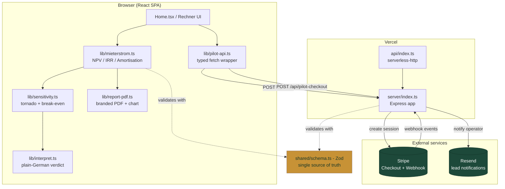
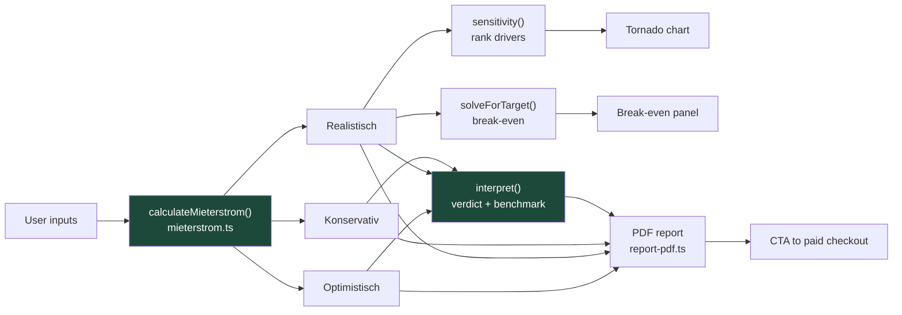
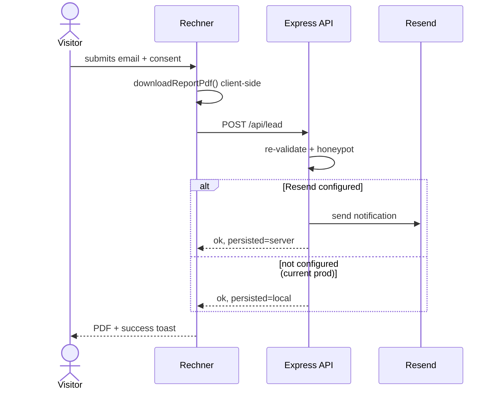
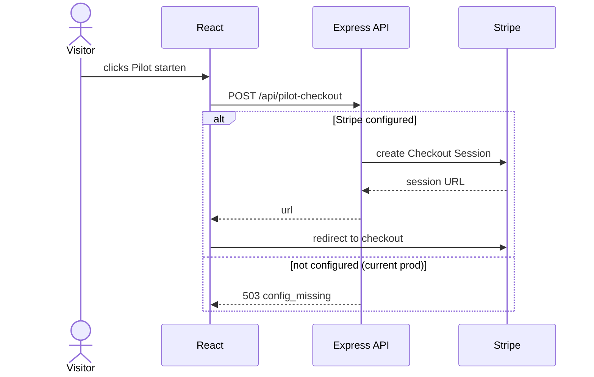
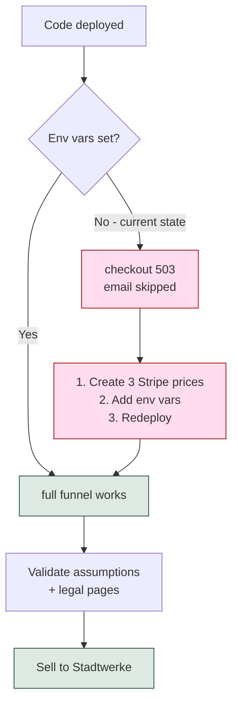
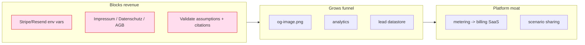

# Energie Teilen

**Bezahlte Pilotaufnahme für lokale Energieprojekte** — a productized-intake platform for German *Mieterstrom* / *gemeinschaftliche Gebäudeversorgung* (§ EnWG) projects. A prospect models a project's economics in the browser, downloads a branded PDF report, and converts into one of three paid "pilot" packages via Stripe Checkout.

> **Status (June 2026):** Live at [energie-teilen-site.vercel.app](https://energie-teilen-site.vercel.app/). Calculator, report, and lead capture work in production. **Paid checkout and lead-email are inert until the Stripe/Resend env vars are set in Vercel** — see [§7](#7-go-live-checklist).

## Table of contents

1. [What this is (and isn't)](#1-what-this-is-and-isnt)
2. [Architecture](#2-architecture)
3. [The Rechner pipeline](#3-the-rechner-pipeline)
4. [Request & data flows](#4-request--data-flows)
5. [Repository map](#5-repository-map)
6. [Local development](#6-local-development)
7. [Go-live checklist](#7-go-live-checklist)
8. [Deployment](#8-deployment)
9. [Roadmap to revenue](#9-roadmap-to-revenue)

---

## 1. What this is (and isn't)

**It is** a marketing site + a self-serve economic calculator + a paid intake funnel. The v1 "database" is the operator's inbox (leads via Resend); payments via Stripe Checkout.

**It is not** (yet) a metering/billing SaaS, a P2P trading platform, or a CRM — deliberate future scope, see the [roadmap](#9-roadmap-to-revenue).

| Layer | Technology |
|---|---|
| Frontend | React 19, Vite 7, TypeScript, Tailwind, Radix (shadcn), Recharts, Framer Motion, wouter |
| Backend | Express 4 on Vercel serverless (`serverless-http`) |
| Validation | Zod (shared schema, client + server) |
| Payments | Stripe Checkout + webhook |
| Email | Resend |
| PDF | jsPDF + jspdf-autotable (client-side) |
| Tests | Vitest |

---

## 2. Architecture



- **One Zod schema** validates on client *and* server — types never drift.
- **Graceful degradation**: without env vars the API returns clean `503 config_missing` instead of crashing (current prod state).
- **All financial math is deterministic**, runs in the browser, auditable, unit-tested, no ML.

---

## 3. The Rechner pipeline



| Module | Responsibility | Tested |
|---|---|---|
| `mieterstrom.ts` | 20-year cashflow: NPV, IRR, amortisation, CO2 | 12 tests |
| `sensitivity.ts` | driver ranking + break-even solver | 5 tests |
| `interpret.ts` | plain-German verdict / break-even / benchmark | via report tests |
| `report-pdf.ts` | branded PDF: chart, links, CTA | valid-PDF + link tests |

> The **scenario assumptions** and **benchmark band** (`6-10%`, placeholder in `interpret.ts`) still need a Mieterstrom underwriter's sign-off before selling.

---

## 4. Request & data flows

### Lead capture (free report)



### Paid pilot checkout



---

## 5. Repository map

```text
energie-teilen-site/
  api/index.ts            Vercel serverless entry (wraps Express)
  server/index.ts         Express: health, lead, pilot-checkout, webhook
  shared/schema.ts        Zod schemas - single source of truth
  shared/const.ts         offer codes, constants
  client/index.html       SEO meta, OG, JSON-LD
  client/src/pages/Home.tsx       one-page site (hero, Rechner, lead band)
  client/src/lib/
    mieterstrom.ts        economic engine + tests
    sensitivity.ts        tornado + break-even solver + tests
    interpret.ts          plain-German verdict
    report-pdf.ts         branded PDF generator + tests
    pilot-api.ts          typed fetch wrapper
  client/src/components/
    SensitivityTornado.tsx  BreakEvenPanel.tsx
    HeroRotator.tsx         SectionRotator.tsx
  scripts/fetch-hero-images.mjs   Unsplash downloader -> self-hosted webp
  vercel.json             security headers, SPA rewrite
```

---

## 6. Local development

```bash
corepack enable && corepack prepare pnpm@10 --activate
pnpm install
pnpm dev:all
```

| Command | Purpose |
|---|---|
| `pnpm dev:all` | frontend (3000) + API (3001) |
| `pnpm check` | typecheck |
| `pnpm exec vitest run` | tests |
| `pnpm build` | production build |
| `pnpm format` | Prettier |

Pre-deploy gate: `pnpm exec tsc --noEmit && pnpm exec vitest run && pnpm build`

---

## 7. Go-live checklist

Set in **Vercel -> Settings -> Environment Variables** (Production), then redeploy.



| Variable | Used for |
|---|---|
| `STRIPE_SECRET_KEY` | create Checkout sessions |
| `STRIPE_PRICE_ET_ELIGIBILITY` | price ID, tier 1 |
| `STRIPE_PRICE_ET_STRUCTURING` | price ID, tier 2 |
| `STRIPE_PRICE_ET_MANDATE` | price ID, tier 3 |
| `STRIPE_WEBHOOK_SECRET` | verify webhook signatures |
| `RESEND_API_KEY` | send lead notifications |
| `RESEND_FROM_EMAIL` | verified sender |
| `LEAD_NOTIFICATION_EMAIL` | lead destination |
| `APP_URL` | absolute URL for redirects |

> Start in Stripe **test mode** (`sk_test_...`, card `4242 4242 4242 4242`). When `GET /api/health` shows `stripe: true`, switch to live keys.

---

## 8. Deployment

Auto-deploys from `main` via GitHub -> Vercel.

```bash
pnpm exec tsc --noEmit && pnpm exec vitest run && pnpm build
git add -A && git commit -m "..." && git push origin main
```

Env-var changes require a redeploy to take effect.

---

## 9. Roadmap to revenue



**Strategy:** the calculator already beats most competitors' public tools — the path to money is (1) turn on checkout, (2) be legally shippable, (3) get the numbers validated.

### Honest caveats

- Benchmark band + scenario assumptions are hedged placeholders, **not** underwriter-validated.
- The § EnWG citation needs an energy lawyer (brand = energy sharing §42c; product describes §42b).
- PDF contact is a personal Gmail — swap to a domain address (one constant in `report-pdf.ts`).
- Documents the repo at commit `cecd53f`; keep in sync as it evolves.
